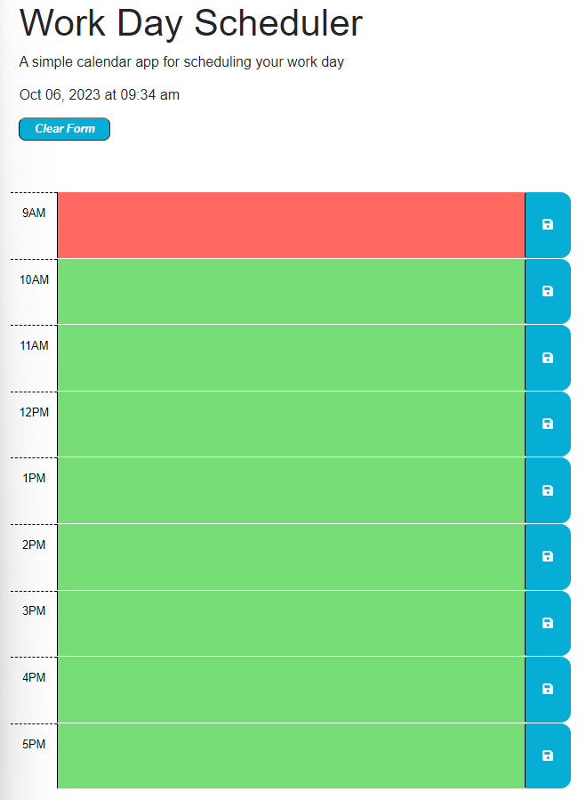

# Work Day Scheduler

This projects allows you to plan out your workday in a clean and concise manner. simply type your to-do items in the colored box and press the save button to the right of the text field. If you are done with the day simply press the clear form button to wipe the page clean. 

The code uses a single event listener for all of the save buttons. This along with a constructor that builds each hour object before adding it to an array and commiting it to local storage means the project can be scaled with relative ease. 

this project uses HTML, CSS, BootStrap, JavaScript, DayJS, and JQuery.

